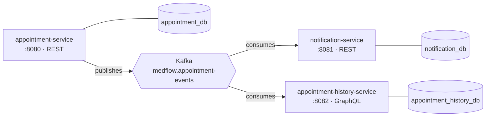

# MedFlow Services

**MedFlow is a microservices-based backend** for scheduling medical appointments, built with Spring Boot and
communicating asynchronously via Kafka.

## Overview

The system is split into three independent services, each owning its data and exposing its own API style:

| Service                                                        | Port   | API     | Responsibility                                             |
|------------------------------------------------------------------|--------|---------|-------------------------------------------------------------|
| [appointment-service](appointment-service/README.md)             | `8080` | REST    | Owns the appointment lifecycle (create, update, cancel, list) |
| [notification-service](notification-service/README.md)           | `8081` | REST    | Sends and records patient reminders                        |
| [appointment-history-service](appointment-history-service/README.md) | `8082` | GraphQL | Records an append-only history of appointment events       |

Each service follows a hexagonal architecture (`adapter/in`, `adapter/out`, `application/port`,
`application/service`, `domain`), with its own PostgreSQL database — see each service's README for domain rules and
endpoints.

## Architecture and Service Communication



- **appointment-service** is the source of truth for appointments. Every create, update or cancel publishes an event
  to the Kafka topic `medflow.appointment-events`.
- **notification-service** and **appointment-history-service** independently consume the same topic — there is no
  direct HTTP call between services, so a slow or unavailable consumer never blocks appointment scheduling.
- **notification-service** turns each event into a reminder message (currently logged, not really emailed/SMS'd —
  the `ReminderSenderPort` is a stub, ready to be swapped for a real channel) and stores the outcome.
- **appointment-history-service** turns each event into an append-only history entry, queryable by appointment or by
  patient.

### When is a reminder sent?

The reminder is reactive to the event — it is sent as soon as the event is received, not scheduled based on
appointment proximity. The message varies by event:

| Event received          | `status` in payload   | Message sent                          |
|--------------------------|------------------------|----------------------------------------|
| `APPOINTMENT_CREATED`     | —                      | Appointment scheduled                  |
| `APPOINTMENT_UPDATED`     | other than `CANCELED`  | Appointment updated (new time)         |
| `APPOINTMENT_UPDATED`     | `CANCELED`             | Appointment canceled                   |

(appointment-service does not emit a distinct `APPOINTMENT_CANCELED` event — cancellation is a status update, so it
arrives as `APPOINTMENT_UPDATED` with `status = CANCELED`.)

## Technologies

| Technology        | Version |
|:-------------------|:--------|
| Java               | 25      |
| Spring Boot        | 4.1.1   |
| PostgreSQL         | 16      |
| Apache Kafka       | 4.0     |
| Docker             | latest  |
| Docker Compose     | latest  |
| JUnit 5 / Mockito  | latest  |
| GraphQL            | Spring for GraphQL |

## Setup and Execution

### Prerequisites

- Java 25
- Maven 3.9+
- Docker and Docker Compose

### 1. Infrastructure (PostgreSQL + Kafka)

```bash
docker compose up -d
```

This starts PostgreSQL (user/password `medflow`/`medflow`) and Kafka on `localhost:9092`. On the volume's first run,
the scripts in `infra/postgres-init/` create the `notification_db` and `appointment_history_db` databases (besides
the container's default `appointment_db`), each service's schema (DDL) and test seed data — services no longer
manage the schema via Hibernate (`ddl-auto=none`).

If the Postgres volume already exists from a previous run (before these scripts existed), recreate the volume
(`docker compose down -v && docker compose up -d`) or apply the scripts manually:

```bash
docker exec -i medflow-postgres psql -U medflow -d appointment_db < infra/postgres-init/01-create-databases.sql
docker exec -i medflow-postgres psql -U medflow -d appointment_db < infra/postgres-init/02-appointment-service-schema.sql
docker exec -i medflow-postgres psql -U medflow -d appointment_db < infra/postgres-init/03-appointment-service-seed.sql
docker exec -i medflow-postgres psql -U medflow -d appointment_db < infra/postgres-init/04-notification-service-schema.sql
docker exec -i medflow-postgres psql -U medflow -d appointment_db < infra/postgres-init/05-appointment-history-service-schema.sql
```

### 2. Services

```bash
cd appointment-service && ./mvnw spring-boot:run           # port 8080
cd notification-service && ./mvnw spring-boot:run          # port 8081
cd appointment-history-service && ./mvnw spring-boot:run   # port 8082
```

Or run everything, services included, with Docker Compose:

```bash
docker compose up --build
```

The seed script (`infra/postgres-init/03-appointment-service-seed.sql`) already populates test users, password
`123456` for all:

| Username     | Role    |
|--------------|---------|
| `dr.house`   | DOCTOR  |
| `nurse.joy`  | NURSE   |
| `john.doe`   | PATIENT |

## Environment Variables

| Variable                        | Description                | Default (docker-compose)                              |
|----------------------------------|-----------------------------|--------------------------------------------------------|
| `SPRING_DATASOURCE_URL`          | JDBC URL for the service's database | `jdbc:postgresql://postgres:5432/<service>_db` |
| `SPRING_DATASOURCE_USERNAME`     | Database username           | `medflow`                                              |
| `SPRING_DATASOURCE_PASSWORD`     | Database password           | `medflow`                                              |
| `SPRING_KAFKA_BOOTSTRAP_SERVERS` | Kafka bootstrap servers     | `kafka:19092`                                          |
| `SPRING_JPA_SHOW_SQL`            | Log generated SQL           | `false`                                                |

## Testing

`.http` request collections (compatible with the VS Code / IntelliJ HTTP Client REST extension) are available in
[`requests/`](requests):

- [`requests/1.appointment.http`](requests/1.appointment.http) — create, update, cancel and list appointments.
- [`requests/2.notification.http`](requests/2.notification.http) — query the reminders generated from events.
- [`requests/3.appointment-history.http`](requests/3.appointment-history.http) — query the history via GraphQL.

End-to-end flow: create/update/cancel an appointment in `1.appointment.http`, then check the corresponding reminder
in `2.notification.http` and the history entry in `3.appointment-history.http` (or the interactive console at
`http://localhost:8082/graphiql`).

### Running Automated Tests

Each service is a self-contained Maven module:

```bash
cd appointment-service && ./mvnw test
cd notification-service && ./mvnw test
cd appointment-history-service && ./mvnw test
```

## Author

**Tiago Toloni**
